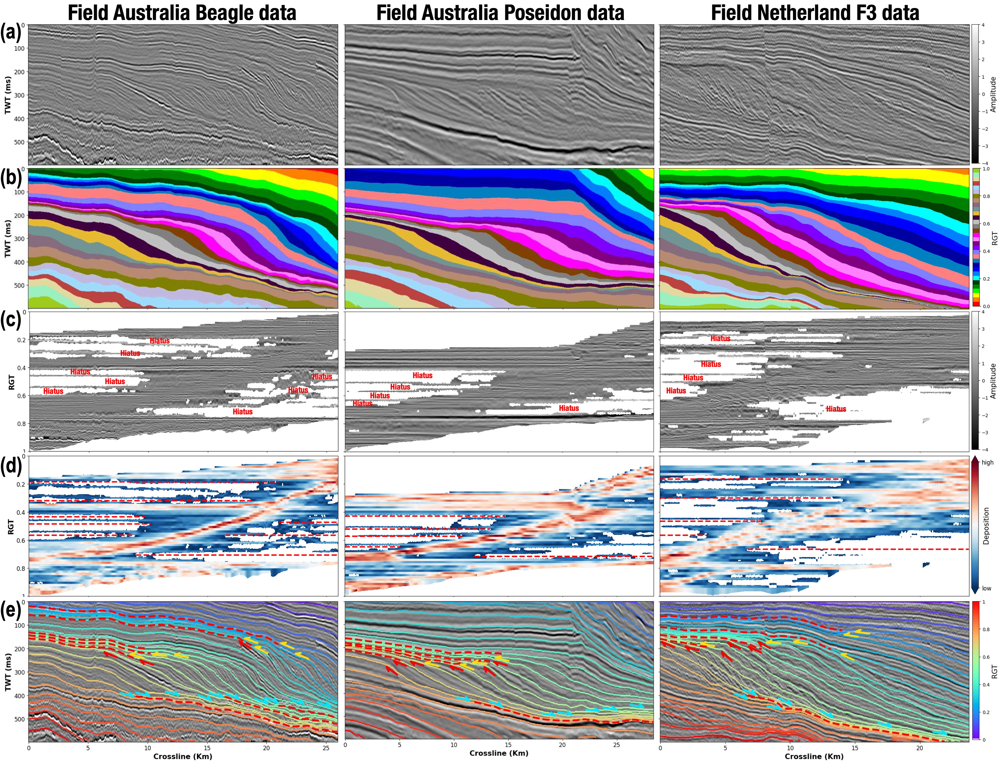

<b>The geologcially-informed AI workflow for automatic fully seismic stratigraphic interpretation</b>
        

    <a href='https://github.com/huigcig/' target='_blank'>Hui Gao1 </a>&emsp;
    <a href='https://github.com/xinwucwp/' target='_blank'>Xinming Wu1,†,‡</a>&emsp;
     <a href='https://github.com/XuesongDing/' target='_blank'>Xuesong Ding 2</a>&emsp;

    1
    University of Science and Technology of China&emsp;
    2
    The University of Texas at Austin&emsp;
     
    <!-- * Equal Contribution&emsp; -->
    † Corresponding Author&emsp;
    ‡ Project Lead&emsp;

----------------------------------

## 🌟 An intelligent geologically-informed and data-driven approach for fully seismic stratigraphic interpretation of sedimentary basin
### 1. Stratigraphic and geophysical forward modeling
* The geological and geophysical forward modeling workflow are modified from [ClinoformNet](https://github.com/huigcig/ClinoformNet) (Gao et al.,GMD, 2023). 
* In the updated workflow, **geological forward modeling** contians SFM with [PyBadlands](https://github.com/badlands-model/badlands) and adding folding (& faulting) stuctures [(Wu et al., Geophysics, 2020)](https://library.seg.org/doi/10.1190/geo2019-0375.1), while **geophysical forward modeling** contains building realistic porosity model, Biot-Gassmann theory, depth-to-time conversion, and building synthetic seismic images.
* **The labeled synthetic seismic datasets** are publicly available at [Zenodo](https://doi.org/10.5281/zenodo.14678398).

### 2. Labeled supervison and geologically-informed unsupervision
* In the labeled supervison, we use the $L_{MSE}$ and $L_{MS-SSIM}$ to train the network with labeled synthetic training datasets.
* In the **geologically-informed unsupervision**, we implement two unsupervised losses (**$L_{Isochron}$** and **$L_{Normal}$**) based on the geologically-informed priors. 
* Beforing using the **$L_{Isochron}$** and **$L_{Normal}$**, we need to track the local horizon segments and estimate the normal vectors from seismic images. [ Details in the folder: {1.Strat_skeleton 2.track_local_horizon} ]
* **Additionally, $L_{Isochron}$ and $L_{Normal}$ do not require labels**, enabling incorporating the unlabeled field datasets for training.

### 3. Progressive model training

 $L_{final} = \lambda_1 \cdot L_{MSE} + \lambda_2 \cdot L_{MS-SSIM} + \lambda_3 \cdot L_{Isochron} + \lambda_4 \cdot L_{Normal}$ 

* In the training stage-1, we only use the $L_{MSE}$ and $L_{MS-SSIM}$ for pre-train the network with labeled synthetic datasets. ($\lambda_1 = 0.8, \lambda_2 = 0.2, \lambda_3 = \lambda_4 = 0 $)
* In the training stage-2, we introduce $L_{Isochron}$ and $L_{Normal}$ for further train the network after stage-1 with labeled synthetic datasets. ($\lambda_1 = 0.8, \lambda_2 = 0.2, \lambda_3 = 0.1, \lambda_4 = 10 $)
* In the final training stage-3, we incorporate the unlabeled field datasets for LoRA fine-tuning with $L_{Isochron}$ and $L_{Normal}$. ($\lambda_1 = \lambda_2 = 0, \lambda_3 = 0.1, \lambda_4 = 10 $)
* The predicted results are progressively improved during the different training stages. 

### 4. Fully seismic stratigraphic interpretation

* After estimating fully horizon volume (RGT), we can easily achieve the seismic stratigraphic interpretation.

---------------------

### References
[1] Gao, H., Wu, X., Zhang, J., Sun, X. & Bi, Z. Clinoformnet-1.0: stratigraphic forward modeling and deep learning for seismic clinoform delineation. Geoscientific Model Development 16, 2495–2513 (2023).

[2] Salles, T., Ding, X. & Brocard, G. pybadlands: A framework to simulate sediment transport, landscape dynamics and basin stratigraphic evolution through space and time. PloS one 13, e0195557 (2018).

[3] Ding, X., Salles, T., Flament, N. & Rey, P. Quantitative stratigraphic analysis in a source-to- sink numerical framework. Geoscientific Model Development 12, 2571–2585 (2019).

[4] Wu, X. et al. Building realistic structure models to train convolutional neural networks for seismic structural interpretation. Geophysics 85, WA27–WA39 (2020).

