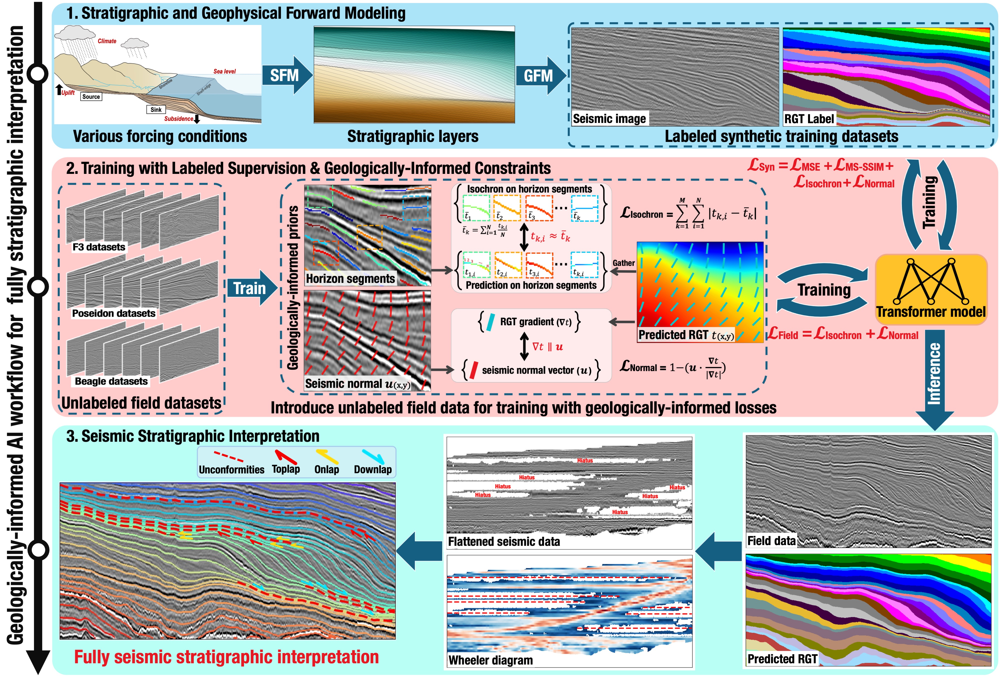

<b>The geologcially-informed AI workflow for automatic fully seismic stratigraphic interpretation</b>
        

    <a href='https://github.com/huigcig/' target='_blank'>Hui Gao1 </a>&emsp;
    <a href='https://github.com/xinwucwp/' target='_blank'>Xinming Wu1,†,‡</a>&emsp;
     <a href='https://github.com/XuesongDing' target='_blank'>Xuesong Ding 2</a>&emsp;

    1
    University of Science and Technology of China&emsp;
    2
    The University of Texas at Austin&emsp;
     
    <!-- * Equal Contribution&emsp; -->
    † Corresponding Author&emsp;
    ‡ Project Lead&emsp;

----------------------------------

## 🌟 An intelligent geologically-informed and data-driven approach for fully seismic stratigraphic interpretation of sedimentary basin
### 1. Stratigraphic and geophysical forward modeling
* The geological and geophysical forward modeling workflow are modified from [**ClinoformNet**](https://github.com/huigcig/ClinoformNet) (Gao et al.,GMD, 2023). 
* In the updated workflow, **geological forward modeling** contians SFM with [PyBadlands](https://github.com/badlands-model/badlands) and adding folding (& faulting) stuctures [(Wu et al., Geophysics, 2020)](https://library.seg.org/doi/10.1190/geo2019-0375.1), while **geophysical forward modeling** contains building realistic porosity model, Biot-Gassmann theory, depth-to-time conversion, and building synthetic seismic images.

### 2. Labeled supervison and geologically-informed unsupervision
* In the labeled supervison, we use the $L_{MSE}$ and $L_{MS-SSIM}$ to train the network with labeled synthetic training datasets.
* In the **geologically-informed unsupervision**, we implement two unsupervised losses (**$L_{Isochron}$** and **$L_{Normal}$**) based on the geologically-informed priors.
* Beforing using the **$L_{Isochron}$** and **$L_{Normal}$**, we need to track the local horizon segments and estimate the normal vectors from seismic images. [ Details in the folder: {1.Strat_skeleton 2.track_local_horizon} ]

### 3. Progressive model training

<b> $L_{total} = L_{MSE} + L_{MS-SSIM} + L_{Isochron} + L_{Normal}$ </b>

* 

 

